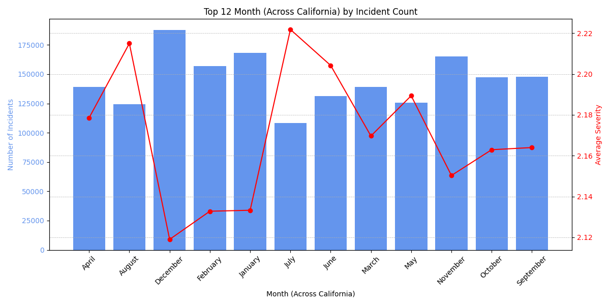
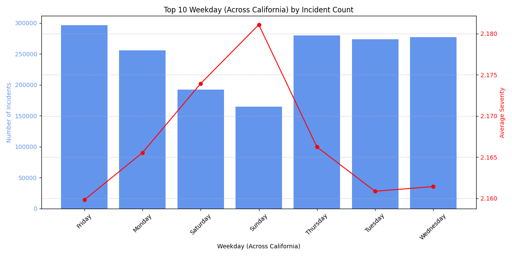
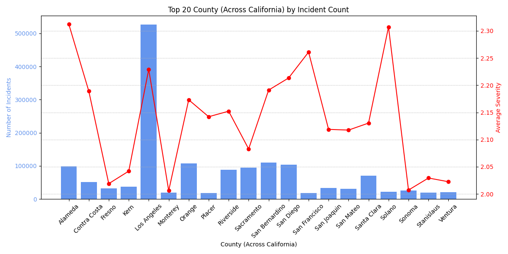
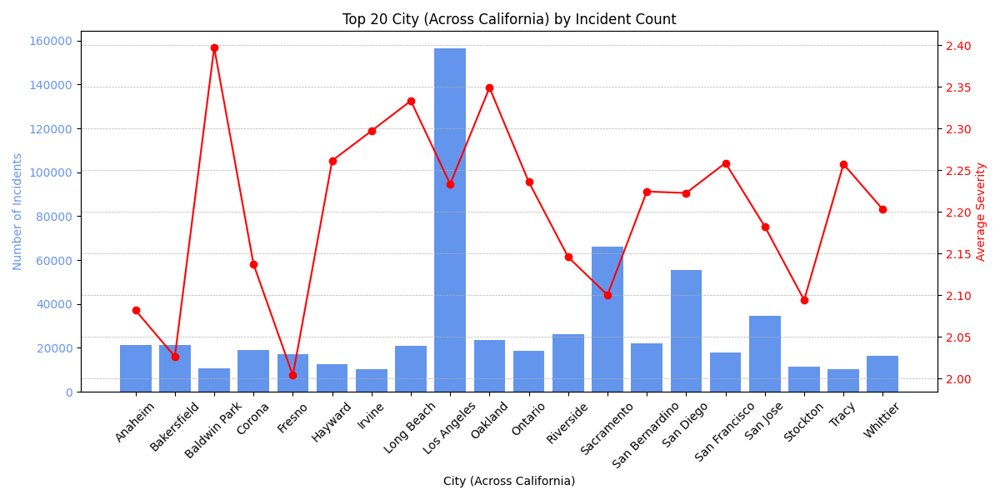
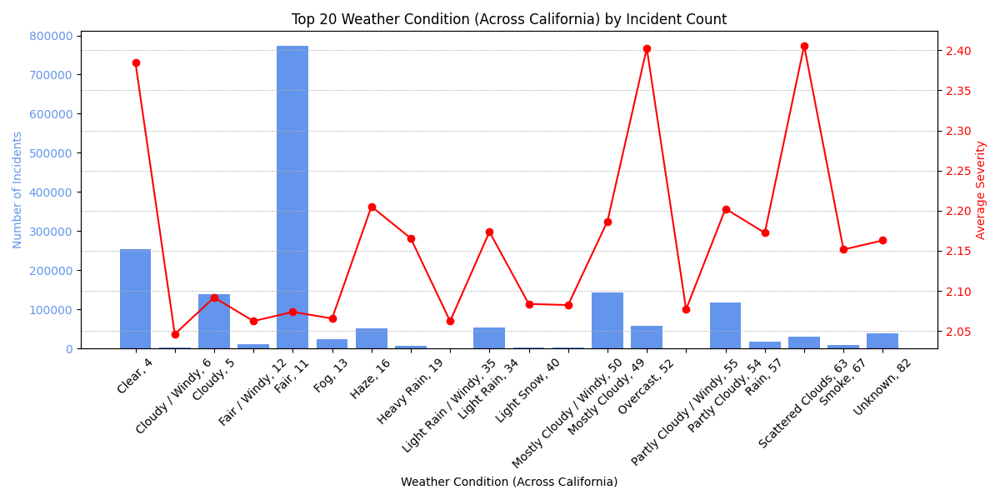
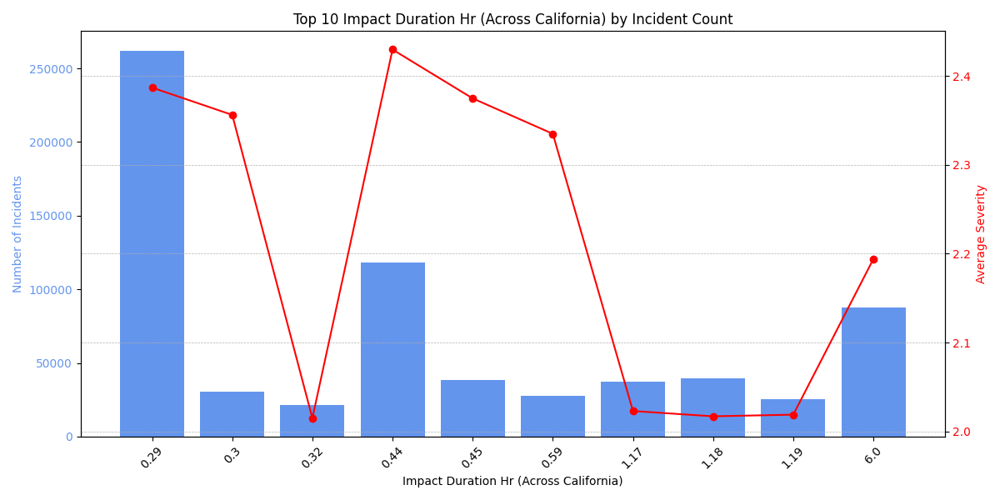
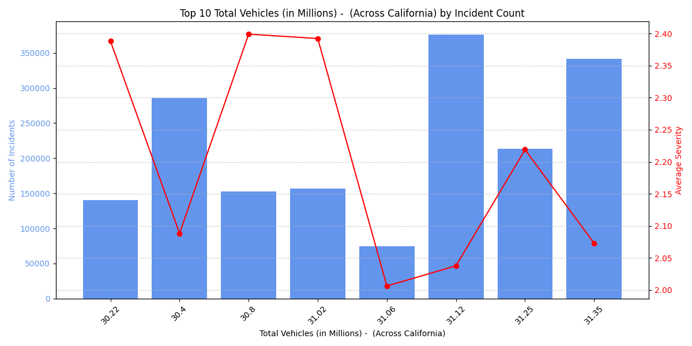
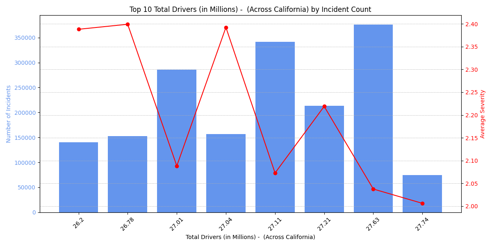

### AI-Based Prediction of Road Accidents and Road Rage Using Traffic Data

**Hemant Deshpande**

[Juypter Notebook](https://github.com/hemant280/berkely-ai-ml-capstone/blob/main/analysis.ipynb)

[Environment Details (requrement.txt)](https://github.com/hemant280/berkely-ai-ml-capstone/requirement.txt)

#### Executive summary

Road accidents and related incidents of road rage remain among the leading causes of preventable injuries and fatalities in the United States. As state and local agencies seek more effective strategies to reduce traffic dangers, predictive analytics has become a crucial tool for proactive intervention. This capstone project leverages publicly available, state-level traffic accident data to develop and test machine learning models for predicting both the likelihood and severity of road accidents—and to identify risk factors associated with road rage behaviors.

The analysis will use the US Accidents dataset from Kaggle (filtered for a single state such as California), alongside accident data, data for registered vehicles and licensed drivers is used. After cleaning and exploring the data, the project will employ advanced feature engineering and select machine learning models—such as Random Forest, Logistic Regression, and XGBoost—choosing algorithms tailored to the state-specific data volume and complexity. Spatial analysis and time-based trends will be examined to identify accident hotspots and high-risk conditions.

Expected outcomes include accurate, interpretable prediction models for accident severity and crash probabilities at the state level; the identification of critical temporal, spatial, weather, and behavioral risk factors; and actionable recommendations for targeted interventions and real-time alerts. The project’s results are expected to support state and local agencies in improving road safety, optimizing resource allocation, and designing focused educational or enforcement campaigns to curb dangerous driving and road rage incidents.

By narrowing the analysis to a single state, the project ensures computational feasibility and direct operational relevance for policymakers. Ultimately, this initiative will demonstrate the practical utility of modern data science techniques in addressing complex transportation safety challenges and contribute to the broader goal of safer roads for all.

#### Rationale
The rationale for this capstone project is rooted in the significant societal and economic impact of road accidents and road rage, and the opportunity to leverage data science for safer transportation:

- **Public Safety Prioritization**: Accidents and road rage incidents result in thousands of fatalities, injuries, and substantial financial losses each year. By predicting where and when such events are likely to occur, state agencies can deploy targeted interventions to prevent crashes and save lives.

- **Actionable Insights for Local Agencies**: A state-specific approach allows findings to inform direct, operational decisions suited to unique regional traffic patterns, weather conditions, and behavioral trends, maximizing practical relevance for enforcement, education, and infrastructure planning.

- **Efficient Use of Computational Resources**: Limiting analysis to a single state, balances data depth and computational feasibility, enabling rigorous modeling a MacBook.

- **Advanced Analytical Capabilities**: Employing machine learning enables uncovering complex, nonlinear relationships among risk factors (such as aggressive driving, weather, and time-of-day), which traditional methods might miss, leading to more accurate and timely predictions.

- **Real-World Impact**: The insights generated can guide targeted public awareness campaigns, improved road design, optimized law enforcement patrolling, and even integration into real-time navigation systems for driver alerts, directly contributing to accident reduction and safer communities.

#### Research Question
Can machine learning models accurately predict the occurrence and severity of road accidents—and identify risks related to road rage incidents—by analyzing publicly available traffic and behavioral data from US road networks?

#### Data Sources
The analysis will utilize the US Accidents dataset from Kaggle, filtered by state (such as California, Texas, or another of interest). The dataset contains millions of accident records across the US, but the analysis will be limited to one chosen state for computational feasibility and model relevance. 

#### Methodology
- Exploratory data analysis and feature engineering on state-specific traffic, weather, and behavioral factors
- Machine learning models (such as Random Forest, Gradient Boosting, Logistic Regression) with algorithm selection based on the data volume and complexity
- Time-series analysis to study patterns over time and geography within the state
- Appropriate model evaluation metrics such as accuracy, precision, recall, F1-Score, etc

**High level Approach**

Following steps taken to prepare and train model.
- Preprocessing numerical columns
- Preprocessing categorical columns
- Identify correlations
- Split the dataset for training and testing
- Principal Component Analysis (PCA) to reduce the feature count
- Training and Fiting the model (classifiers):

### Exploratory Data Analysis (EDA)

The exploratory data analysis was conducted on California accident data from the US Accidents dataset (2016-2023), providing comprehensive insights into traffic accident patterns, risk factors, and temporal/spatial distributions.

#### Dataset Overview and Scope
- **Original Dataset**: 7.7 million accident records across 49 US states (2016-2023)
- **California Subset**: Filtered to California-specific accidents for focused analysis
- **Data Integration**: Combined with vehicle registration and licensed driver data by year
- **Time Period**: February 2016 to March 2023
- **Geographic Coverage**: All California counties and cities

#### Data Quality and Preprocessing
**Missing Value Analysis:**
- Identified columns with >10% missing values: End_Lat, End_Lng, Wind_Chill(F), Precipitation(in)
- Removed irrelevant geographic details (lat/lng coordinates) to focus on state-level analysis
- Applied median imputation for numerical variables with <10% missing values
- Converted categorical missing values to "Unknown" category for Weather_Condition

**Feature Engineering:**
- Created `Impact_Duration_HR` from Start_Time and End_Time differences
- Extracted temporal features: Start_Year, month, weekday patterns
- Converted boolean POI annotations to integer format for analysis
- Integrated external datasets: vehicle registrations and driver licenses by year

#### Temporal Patterns

**Monthly Distribution:**
- **Peak Months**: October, November, and December show highest accident frequencies
- **Seasonal Pattern**: Clear increase in accidents during fall/winter months
- **Severity Trends**: Average severity remains relatively consistent across months (2.0-2.2 range)

**Weekly Distribution:**
- **Weekday Dominance**: Monday through Friday show significantly higher accident rates
- **Weekend Pattern**: Saturday and Sunday have notably fewer incidents
- **Commuter Impact**: Pattern suggests strong correlation with work commute schedules

#### Geographic Distribution

**County-Level Analysis:**
- **Top Counties**: Los Angeles, Orange, Sacramento, San Diego lead in absolute numbers
- **Urban Concentration**: Major metropolitan areas dominate accident statistics
- **Population Correlation**: Higher incident rates align with population density

**City-Level Hotspots:**
- **Major Cities**: Los Angeles, San Diego, Sacramento, San Jose show highest concentrations
- **Severity Patterns**: Urban areas tend to have slightly lower average severity (more traffic delays vs. major crashes)

#### Weather and Environmental Factors

**Weather Impact:**
- **Clear Conditions**: Majority of accidents occur during fair weather (counterintuitive finding)
- **Adverse Weather**: Rain, fog, and cloudy conditions show elevated severity levels
- **Visibility Correlation**: Lower visibility conditions associated with higher accident severity

_california.png)

**Visibility Patterns:**
- **Optimal Visibility**: 10-mile visibility shows highest accident frequency
- **Reduced Visibility**: <5 miles visibility correlates with increased severity
- **Weather Dependency**: Visibility strongly linked to weather conditions

#### Infrastructure and Road Features

**Point of Interest (POI) Analysis:**
The analysis of infrastructure features reveals several key patterns:

- **Traffic Signals**: Present in 23% of accident locations, indicating intersection-related incidents
- **Junctions**: 19% of accidents occur near road junctions
- **Crossings**: 8% involve pedestrian or vehicle crossings
- **Railway Proximity**: 3% occur near railway infrastructure
- **Traffic Calming**: Speed bumps and calming measures present in 2% of locations

#### Statistical Distributions

**Key Numerical Variables:**
- **Severity**: Right-skewed distribution with most accidents rated 2-3 on 1-4 scale
- **Temperature**: Normal distribution centered around 65°F
- **Humidity**: Slightly right-skewed, averaging 60-70%
- **Wind Speed**: Exponential distribution with most incidents during low wind conditions
- **Impact Duration**: Highly right-skewed, most accidents resolved within 2-4 hours

**Duration Analysis:**
- **Quick Resolution**: 80% of accidents resolved within 3 hours
- **Extended Impact**: Small percentage of incidents cause prolonged traffic disruption
- **Severity Correlation**: Longer duration incidents tend to have higher severity ratings

#### Vehicle and Driver Population Context

**Population Correlation:**
- **Vehicle Registration**: 14-15 million registered vehicles in California during study period
- **Licensed Drivers**: 26-27 million licensed drivers
- **Accident Rate**: Relatively stable accident rates despite growing vehicle/driver populations
- **Risk Factors**: Higher vehicle density correlates with increased accident frequency

#### Key Insights and Patterns

**Critical Findings:**
1. **Temporal Risk**: Fall/winter months and weekdays present highest accident risk
2. **Geographic Concentration**: Urban areas account for disproportionate share of incidents
3. **Weather Paradox**: Most accidents occur in clear weather, but severity increases in adverse conditions
4. **Infrastructure Impact**: Traffic control devices and junctions are significant risk factors
5. **Duration Patterns**: Most accidents have short-term traffic impact, but severe incidents cause extended disruption

**Risk Factor Hierarchy:**
1. **Primary**: Time of day/week, geographic location, weather conditions
2. **Secondary**: Infrastructure features, visibility, traffic density
3. **Contextual**: Vehicle population, driver demographics, seasonal variations

**Implications for Modeling:**
- Strong temporal and geographic signals suggest good predictive potential
- Weather and infrastructure features provide valuable risk indicators
- Population context variables help normalize accident rates
- Severity prediction may require different features than occurrence prediction

