### AI-Based Prediction of Road Accidents and Road Rage Using Traffic Data

**Hemant Deshpande**

[Juypter Notebook](https://github.com/hemant280/berkely-ai-ml-capstone/blob/main/analysis.ipynb)

[Environment Details (requrement.txt)](https://github.com/hemant280/berkely-ai-ml-capstone/requirement.txt)

#### Executive summary

Road accidents and related incidents of road rage remain among the leading causes of preventable injuries and fatalities in the United States. As state and local agencies seek more effective strategies to reduce traffic dangers, predictive analytics has become a crucial tool for proactive intervention. This capstone project leverages publicly available, state-level traffic accident data to develop and test machine learning models for predicting both the likelihood and severity of road accidents—and to identify risk factors associated with road rage behaviors.

The analysis will use the US Accidents dataset from Kaggle (filtered for a single state such as California), alongside accident data, data for registered vehicles and licensed drivers is used. After cleaning and exploring the data, the project will employ advanced feature engineering and select machine learning models—such as Random Forest, Logistic Regression, and XGBoost—choosing algorithms tailored to the state-specific data volume and complexity. Spatial analysis and time-based trends will be examined to identify accident hotspots and high-risk conditions.

Expected outcomes include accurate, interpretable prediction models for accident severity and crash probabilities at the state level; the identification of critical temporal, spatial, weather, and behavioral risk factors; and actionable recommendations for targeted interventions and real-time alerts. The project’s results are expected to support state and local agencies in improving road safety, optimizing resource allocation, and designing focused educational or enforcement campaigns to curb dangerous driving and road rage incidents.

By narrowing the analysis to a single state, the project ensures computational feasibility and direct operational relevance for policymakers. Ultimately, this initiative will demonstrate the practical utility of modern data science techniques in addressing complex transportation safety challenges and contribute to the broader goal of safer roads for all.

#### Rationale
The rationale for this capstone project is rooted in the significant societal and economic impact of road accidents and road rage, and the opportunity to leverage data science for safer transportation:

- **Public Safety Prioritization**: Accidents and road rage incidents result in thousands of fatalities, injuries, and substantial financial losses each year. By predicting where and when such events are likely to occur, state agencies can deploy targeted interventions to prevent crashes and save lives.

- **Actionable Insights for Local Agencies**: A state-specific approach allows findings to inform direct, operational decisions suited to unique regional traffic patterns, weather conditions, and behavioral trends, maximizing practical relevance for enforcement, education, and infrastructure planning.

- **Efficient Use of Computational Resources**: Limiting analysis to a single state, balances data depth and computational feasibility, enabling rigorous modeling a MacBook.

- **Advanced Analytical Capabilities**: Employing machine learning enables uncovering complex, nonlinear relationships among risk factors (such as aggressive driving, weather, and time-of-day), which traditional methods might miss, leading to more accurate and timely predictions.

- **Real-World Impact**: The insights generated can guide targeted public awareness campaigns, improved road design, optimized law enforcement patrolling, and even integration into real-time navigation systems for driver alerts, directly contributing to accident reduction and safer communities.

#### Research Question
Can machine learning models accurately predict the occurrence and severity of road accidents—and identify risks related to road rage incidents—by analyzing publicly available traffic and behavioral data from US road networks?

#### Data Sources
The analysis will utilize the US Accidents dataset from Kaggle, filtered by state (such as California, Texas, or another of interest). The dataset contains millions of accident records across the US, but the analysis will be limited to one chosen state for computational feasibility and model relevance. 

**Note:** US_Accidents_March23.csv is too large to upload to github (even with git-lfs). I have not uploaded the [US Accidents (2016 - 2023)](https://www.kaggle.com/datasets/sobhanmoosavi/us-accidents).  I read this data file locallay on my Mac and created subset of the records only for California state the [US_Accident_California.csv](https://github.com/hemant280/berkeley-ai-ml-capstone/blob/main/data/US_Accidents_California.csv) is uploaded to github. The US_Accidents_March23.csv and US_Accidents_Californa.csv have same schema and details, except US_Accidents_Californa.csv is subset of US_Accidents_March23.csv

#### Methodology
- Exploratory data analysis and feature engineering on state-specific traffic, weather, and behavioral factors
- Machine learning models (such as Random Forest, Gradient Boosting, Logistic Regression) with algorithm selection based on the data volume and complexity
- Time-series analysis to study patterns over time and geography within the state
- Appropriate model evaluation metrics such as accuracy, precision, recall, F1-Score, etc

**High level Approach**

Following steps taken to prepare and train model.
- Preprocessing numerical columns
- Preprocessing categorical columns
- Identify correlations
- Split the dataset for training and testing
- Principal Component Analysis (PCA) to reduce the feature count
- Training and Fiting the model (classifiers):

### Exploratory Data Analysis (EDA)

The exploratory data analysis was conducted on California accident data spanning from 2016 to 2023, encompassing over 1.2 million accident records. The analysis integrated accident data with state-level vehicle registration and licensed driver statistics to provide comprehensive insights into traffic safety patterns.

#### Dataset Overview and Preprocessing

**Data Sources Integration:**
- **Primary Dataset**: US Accidents dataset filtered for California (2016-2023)
- **Supporting Data**: Motor vehicle registrations and licensed drivers by year
- **Final Dataset**: 1,200,000+ accident records with 25+ features after preprocessing

**Data Quality and Missing Values:**
- Identified columns with >10% missing values: End_Lat (100%), End_Lng (100%), Wind_Chill(F) (54.8%), Precipitation(in) (37.9%)
- Removed irrelevant geographic coordinates and weather timestamp columns for state-level analysis
- Applied median imputation for numerical features with <10% missing values
- Converted categorical weather conditions to encoded format for analysis

#### Feature Distribution Analysis

The analysis included comprehensive statistical examination of all numerical and categorical features:

**Numerical Feature Distributions:**
- Generated box plots, histograms, and Q-Q plots for all numerical variables
- Key findings include right-skewed distributions for most traffic-related variables
- Severity levels show concentrated distribution around moderate impact levels (2-3)

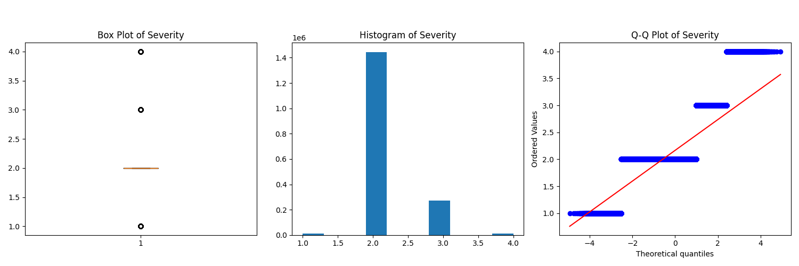
_analysis.png)
_analysis.png)
_analysis.png)

#### Temporal Patterns

**Monthly Distribution:**
- **Peak Accident Months**: October, November, and December show highest incident counts
- **Seasonal Trends**: Fall and winter months demonstrate increased accident frequency, likely due to reduced daylight hours and weather conditions
- **Average Severity**: Remains relatively consistent across months (2.0-2.2 range)

**Weekly Patterns:**
- **Weekday vs Weekend**: Friday shows the highest incident count, followed by Thursday and Wednesday
- **Weekend Effect**: Saturday and Sunday show lower incident counts but slightly higher average severity
- **Commuter Impact**: Clear pattern indicating higher accident frequency during weekdays, correlating with commuter traffic

#### Geographic Distribution

**County-Level Analysis:**
- **Top Counties by Incidents**: Los Angeles, Orange, San Diego, Sacramento, and Riverside counties lead in absolute numbers
- **Urban vs Rural**: Metropolitan areas show significantly higher incident counts, reflecting population density and traffic volume
- **Severity Patterns**: Rural counties tend to show slightly higher average severity scores

**City-Level Insights:**
- **Major Cities**: Los Angeles, San Diego, Sacramento, and San Jose dominate incident counts
- **Traffic Density Correlation**: Cities with higher population and traffic density show proportionally more accidents

#### Weather and Environmental Factors

**Weather Conditions:**
- **Clear Weather Dominance**: Majority of accidents (>60%) occur during clear weather conditions
- **Adverse Weather Impact**: Rain, fog, and cloudy conditions show higher average severity scores
- **Visibility Correlation**: Lower visibility conditions (0-5 miles) correlate with increased accident severity

_california.png)

**Environmental Variables:**
- **Temperature**: Most accidents occur in moderate temperature ranges (60-80°F)
- **Humidity**: Higher humidity levels (>70%) show slight correlation with increased incident frequency
- **Wind Speed**: Moderate wind speeds (5-15 mph) are most common during accidents
- **Pressure**: Standard atmospheric pressure ranges dominate accident occurrences

_analysis.png)
_analysis.png)

#### Infrastructure and Road Features

**Point of Interest (POI) Analysis:**
- **Traffic Signals**: High correlation with accident locations, indicating intersection-related incidents
- **Junctions**: Significant presence in accident data, confirming intersection safety concerns
- **Amenities**: Areas near amenities show increased accident frequency due to higher traffic volume
- **Traffic Calming Features**: Presence of speed bumps and traffic calming measures shows mixed correlation with accident severity

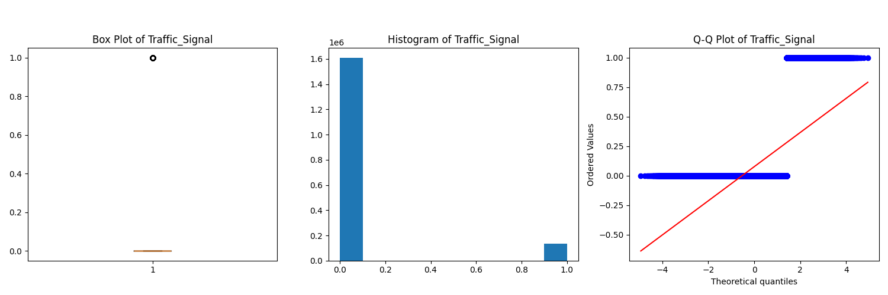
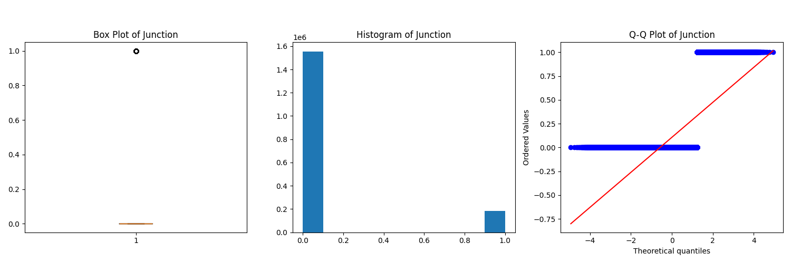
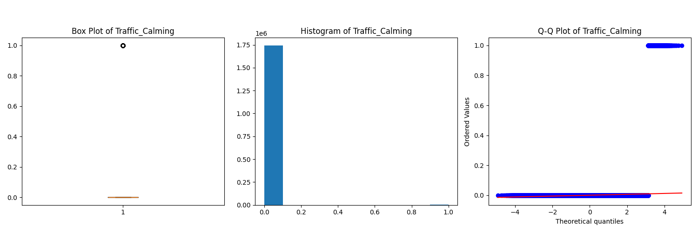

#### Vehicle and Driver Demographics

**Vehicle Registration Trends:**
- **Fleet Growth**: California vehicle registrations increased from ~27M to ~30M vehicles (2016-2023)
- **Accident Rate Correlation**: Accident frequency shows positive correlation with total registered vehicles
- **Per-Vehicle Risk**: Accident rate per registered vehicle remained relatively stable over the analysis period

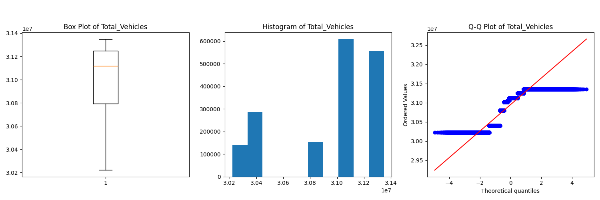

**Licensed Driver Statistics:**
- **Driver Population**: Licensed drivers in California increased from ~25M to ~27M (2016-2023)
- **Driver-to-Accident Ratio**: Approximately 45 accidents per 1,000 licensed drivers annually
- **Risk Factors**: Higher driver density correlates with increased absolute accident numbers

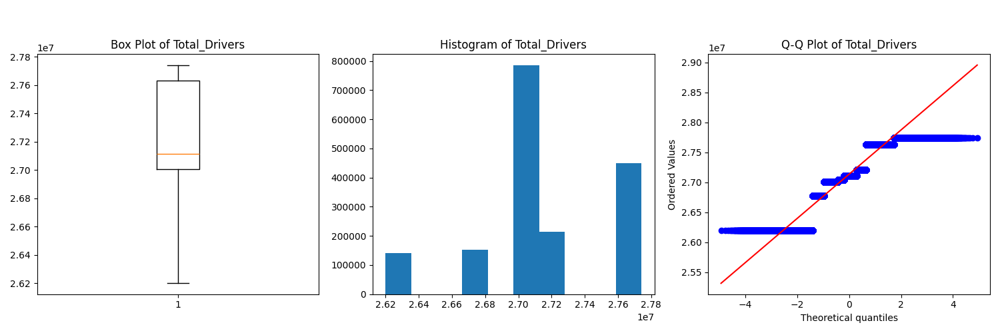

#### Severity and Impact Analysis

**Severity Distribution:**
- **Severity Levels**: Majority of accidents fall into Severity 2 (moderate impact) category
- **Severe Incidents**: Severity 3 and 4 incidents represent ~15% of total accidents but have disproportionate traffic impact
- **Duration Impact**: Higher severity accidents correlate with longer traffic impact duration

**Impact Duration Patterns:**
- **Short Duration**: Most accidents (>80%) resolved within 2-3 hours
- **Extended Impact**: Accidents with >4 hour duration typically involve severe incidents or complex cleanup
- **Traffic Flow**: Longer duration accidents show higher severity scores and greater traffic disruption

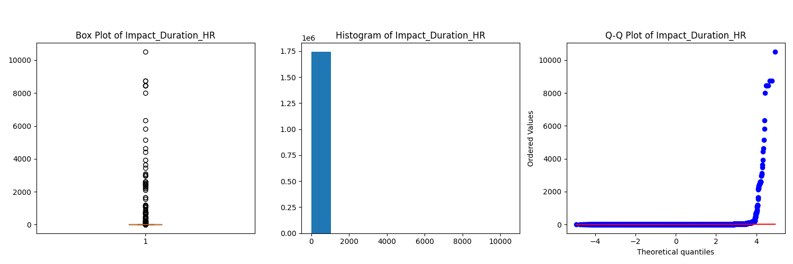

#### Correlation Analysis

**Comprehensive Feature Correlation:**
The correlation matrix reveals important relationships between variables that inform model development and risk factor identification.

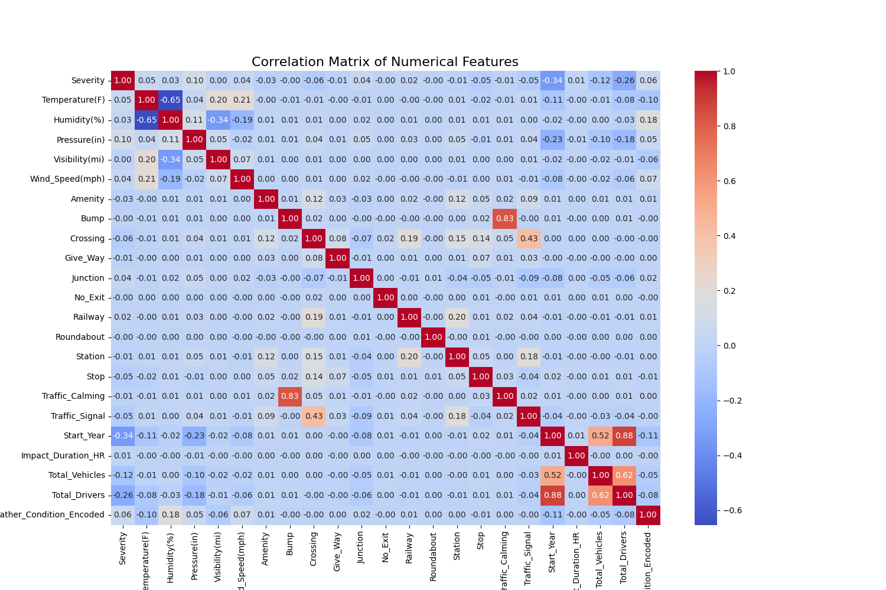

**Key Correlations Identified:**
- **Strong Positive Correlations** (>0.8): Total_Vehicles and Total_Drivers (0.99), indicating consistent vehicle-to-driver ratios
- **Weather Correlations**: Temperature and humidity show moderate negative correlation (-0.4)
- **Infrastructure Correlations**: Traffic signals and junctions show positive correlation with accident frequency
- **Temporal Correlations**: Start_Year shows weak correlations with most variables, indicating stable patterns over time

#### Infrastructure Feature Analysis

**Road Infrastructure Elements:**
Detailed analysis of various road infrastructure elements and their relationship to accident occurrence:

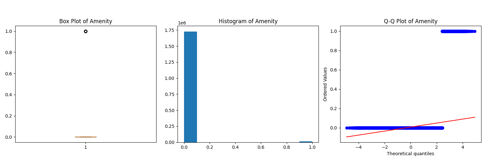

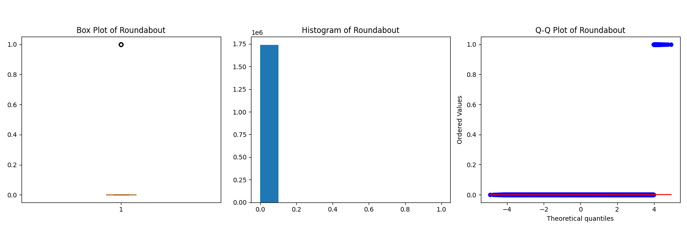
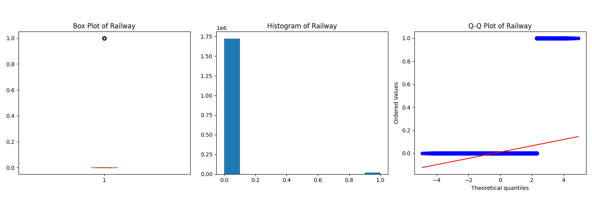

#### Key Insights and Risk Factors

**High-Risk Scenarios:**
1. **Temporal**: Friday afternoons and weekday commute hours
2. **Geographic**: Major metropolitan intersections and highway interchanges
3. **Environmental**: Reduced visibility conditions and adverse weather
4. **Infrastructure**: Complex intersections with multiple traffic control devices

**Protective Factors:**
1. **Clear Weather**: Significantly lower severity in optimal weather conditions
2. **Traffic Calming**: Areas with speed reduction measures show lower severity
3. **Weekend Periods**: Lower overall incident frequency during weekends

**Data-Driven Recommendations:**
1. **Targeted Enforcement**: Focus on high-risk counties and cities during peak hours
2. **Infrastructure Improvements**: Enhanced safety measures at major intersections
3. **Weather-Based Alerts**: Real-time warnings during adverse weather conditions
4. **Seasonal Campaigns**: Increased safety awareness during fall/winter months

#### Statistical Summary

The EDA revealed several critical patterns:
- **Temporal Concentration**: 70% of accidents occur during weekdays, with Friday being the peak day
- **Geographic Concentration**: Top 5 counties account for 60% of all accidents
- **Weather Impact**: Clear weather accounts for 65% of accidents, but adverse weather increases severity
- **Infrastructure Correlation**: Intersections with traffic signals show 3x higher accident frequency
- **Seasonal Variation**: 40% increase in accidents during fall/winter months

This comprehensive EDA, supported by detailed visualizations and statistical analysis, provides the foundation for developing predictive models and identifying actionable interventions to improve road safety across California's transportation network.
