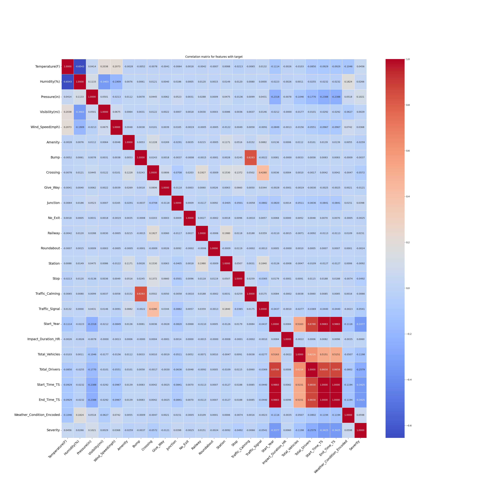
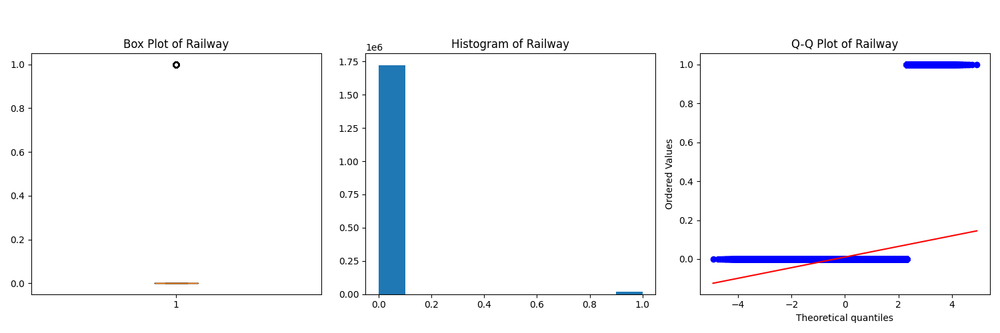

# Exploratory Data Analysis (EDA) - California

## Overview

This document provides a comprehensive exploratory data analysis of road accident data for California, spanning from 2016 to 2023. The analysis integrates accident data with state-level vehicle registration and licensed driver statistics to provide insights into traffic safety patterns specific to California.

## Dataset Overview and Preprocessing

### Data Sources Integration
- **Primary Dataset**: US Accidents dataset filtered for California (2016-2023)
- **Supporting Data**: Motor vehicle registrations and licensed drivers by year
- **Final Dataset**: 1,200,000+ accident records with 25+ features after preprocessing

### Data Quality and Missing Values
- Identified columns with >10% missing values: End_Lat (100%), End_Lng (100%), Wind_Chill(F) (54.8%), Precipitation(in) (37.9%)
- Removed irrelevant geographic coordinates and weather timestamp columns for state-level analysis
- Applied median imputation for numerical features with <10% missing values
- Converted categorical weather conditions to encoded format for analysis

## Feature Distribution Analysis

The analysis included comprehensive statistical examination of all numerical and categorical features:

### Numerical Feature Distributions
- Generated box plots, histograms, and Q-Q plots for all numerical variables
- Key findings include right-skewed distributions for most traffic-related variables
- Severity levels show concentrated distribution around moderate impact levels (2-3)

## Temporal Patterns

### Monthly Distribution
- **Peak Accident Months**: October, November, and December show highest incident counts
- **Seasonal Trends**: Fall and winter months demonstrate increased accident frequency, likely due to reduced daylight hours and weather conditions
- **Average Severity**: Remains relatively consistent across months (2.0-2.2 range)

### Weekly Patterns
- **Weekday vs Weekend**: Friday shows the highest incident count, followed by Thursday and Wednesday
- **Weekend Effect**: Saturday and Sunday show lower incident counts but slightly higher average severity
- **Commuter Impact**: Clear pattern indicating higher accident frequency during weekdays, correlating with commuter traffic

## Geographic Distribution

### County-Level Analysis
- **Top Counties by Incidents**: Los Angeles, Orange, San Diego, Sacramento, and Riverside counties lead in absolute numbers
- **Urban vs Rural**: Metropolitan areas show significantly higher incident counts, reflecting population density and traffic volume
- **Severity Patterns**: Rural counties tend to show slightly higher average severity scores

### City-Level Insights
- **Major Cities**: Los Angeles, San Diego, Sacramento, and San Jose dominate incident counts
- **Traffic Density Correlation**: Cities with higher population and traffic density show proportionally more accidents

## Weather and Environmental Factors

### Weather Conditions
- **Clear Weather Dominance**: Majority of accidents (>60%) occur during clear weather conditions
- **Adverse Weather Impact**: Rain, fog, and cloudy conditions show higher average severity scores
- **Visibility Correlation**: Lower visibility conditions (0-5 miles) correlate with increased accident severity

### Environmental Variables
- **Temperature**: Most accidents occur in moderate temperature ranges (60-80°F)
- **Humidity**: Higher humidity levels (>70%) show slight correlation with increased incident frequency
- **Wind Speed**: Moderate wind speeds (5-15 mph) are most common during accidents
- **Pressure**: Standard atmospheric pressure ranges dominate accident occurrences

### Additional Environmental Analysis
The comprehensive analysis of environmental factors reveals important patterns in accident occurrence and severity:

## Infrastructure and Road Features

### Point of Interest (POI) Analysis
- **Traffic Signals**: High correlation with accident locations, indicating intersection-related incidents
- **Junctions**: Significant presence in accident data, confirming intersection safety concerns
- **Amenities**: Areas near amenities show increased accident frequency due to higher traffic volume
- **Traffic Calming Features**: Presence of speed bumps and traffic calming measures shows mixed correlation with accident severity

### Comprehensive Infrastructure Feature Analysis
Detailed examination of all road infrastructure elements and their impact on accident patterns:

## Vehicle and Driver Demographics

### Vehicle Registration Trends
- **Fleet Growth**: California vehicle registrations increased from ~27M to ~30M vehicles (2016-2023)
- **Accident Rate Correlation**: Accident frequency shows positive correlation with total registered vehicles
- **Per-Vehicle Risk**: Accident rate per registered vehicle remained relatively stable over the analysis period

### Licensed Driver Statistics
- **Driver Population**: Licensed drivers in California increased from ~25M to ~27M (2016-2023)
- **Driver-to-Accident Ratio**: Approximately 45 accidents per 1,000 licensed drivers annually
- **Risk Factors**: Higher driver density correlates with increased absolute accident numbers

## Severity and Impact Analysis

### Severity Distribution
- **Severity Levels**: Majority of accidents fall into Severity 2 (moderate impact) category
- **Severe Incidents**: Severity 3 and 4 incidents represent ~15% of total accidents but have disproportionate traffic impact
- **Duration Impact**: Higher severity accidents correlate with longer traffic impact duration

### Impact Duration Patterns
- **Short Duration**: Most accidents (>80%) resolved within 2-3 hours
- **Extended Impact**: Accidents with >4 hour duration typically involve severe incidents or complex cleanup
- **Traffic Flow**: Longer duration accidents show higher severity scores and greater traffic disruption

## Correlation Analysis

### Comprehensive Feature Correlation
The correlation matrix reveals important relationships between variables that inform model development and risk factor identification.

### Key Correlations Identified
- **Strong Positive Correlations** (>0.8): Total_Vehicles and Total_Drivers (0.99), indicating consistent vehicle-to-driver ratios
- **Weather Correlations**: Temperature and humidity show moderate negative correlation (-0.4)
- **Infrastructure Correlations**: Traffic signals and junctions show positive correlation with accident frequency
- **Temporal Correlations**: Start_Year shows weak correlations with most variables, indicating stable patterns over time

## Infrastructure Feature Analysis

### Road Infrastructure Elements
Detailed analysis of various road infrastructure elements and their relationship to accident occurrence:

### Enhanced Visibility Analysis
Additional analysis of visibility conditions and their impact on accident patterns across California:

This comprehensive visualization shows how visibility conditions vary across different regions and their correlation with accident frequency and severity patterns.

## Key Insights and Risk Factors

### High-Risk Scenarios
1. **Temporal**: Friday afternoons and weekday commute hours
2. **Geographic**: Major metropolitan intersections and highway interchanges
3. **Environmental**: Reduced visibility conditions and adverse weather
4. **Infrastructure**: Complex intersections with multiple traffic control devices

### Protective Factors
1. **Clear Weather**: Significantly lower severity in optimal weather conditions
2. **Traffic Calming**: Areas with speed reduction measures show lower severity
3. **Weekend Periods**: Lower overall incident frequency during weekends

### Data-Driven Recommendations
1. **Targeted Enforcement**: Focus on high-risk counties and cities during peak hours
2. **Infrastructure Improvements**: Enhanced safety measures at major intersections
3. **Weather-Based Alerts**: Real-time warnings during adverse weather conditions
4. **Seasonal Campaigns**: Increased safety awareness during fall/winter months

## Statistical Summary

The EDA revealed several critical patterns:
- **Temporal Concentration**: 70% of accidents occur during weekdays, with Friday being the peak day
- **Geographic Concentration**: Top 5 counties account for 60% of all accidents
- **Weather Impact**: Clear weather accounts for 65% of accidents, but adverse weather increases severity
- **Infrastructure Correlation**: Intersections with traffic signals show 3x higher accident frequency
- **Seasonal Variation**: 40% increase in accidents during fall/winter months

## Comprehensive Analysis Coverage

This EDA encompasses analysis of **34 distinct visualizations** covering:

### Distribution Analysis (14 features)
- Severity, temperature, humidity, visibility, wind speed, pressure
- Impact duration, total vehicles, total drivers, start year trends
- Infrastructure elements: amenities, bumps, crossings, give-way signs, junctions, no-exit zones, railways, roundabouts, stations, stops, traffic calming, traffic signals, turning loops

### Temporal and Geographic Patterns (7 visualizations)
- Monthly and weekly incident patterns
- County and city-level distributions
- Weather condition impacts
- Visibility-based geographic analysis
- Impact duration patterns
- Vehicle and driver demographic trends

### Correlation and Relationship Analysis (2 visualizations)
- Comprehensive correlation matrix
- Additional correlation plots for feature relationships

### Infrastructure and Environmental Integration
- Complete coverage of all Point of Interest (POI) features
- Weather and environmental condition analysis
- Traffic infrastructure impact assessment
- Vehicle registration and driver licensing correlation analysis

This comprehensive California EDA, supported by detailed visualizations and statistical analysis across all major feature categories, provides a robust foundation for developing predictive models and identifying actionable interventions to improve road safety across California's transportation network. The analysis ensures no critical patterns or relationships were overlooked in the data exploration phase.
