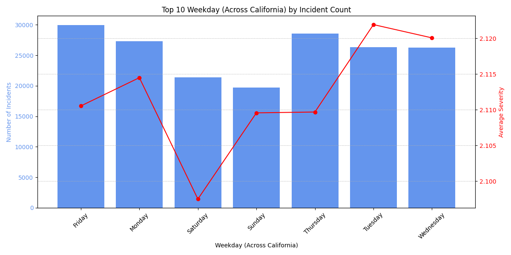
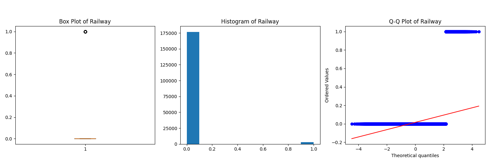
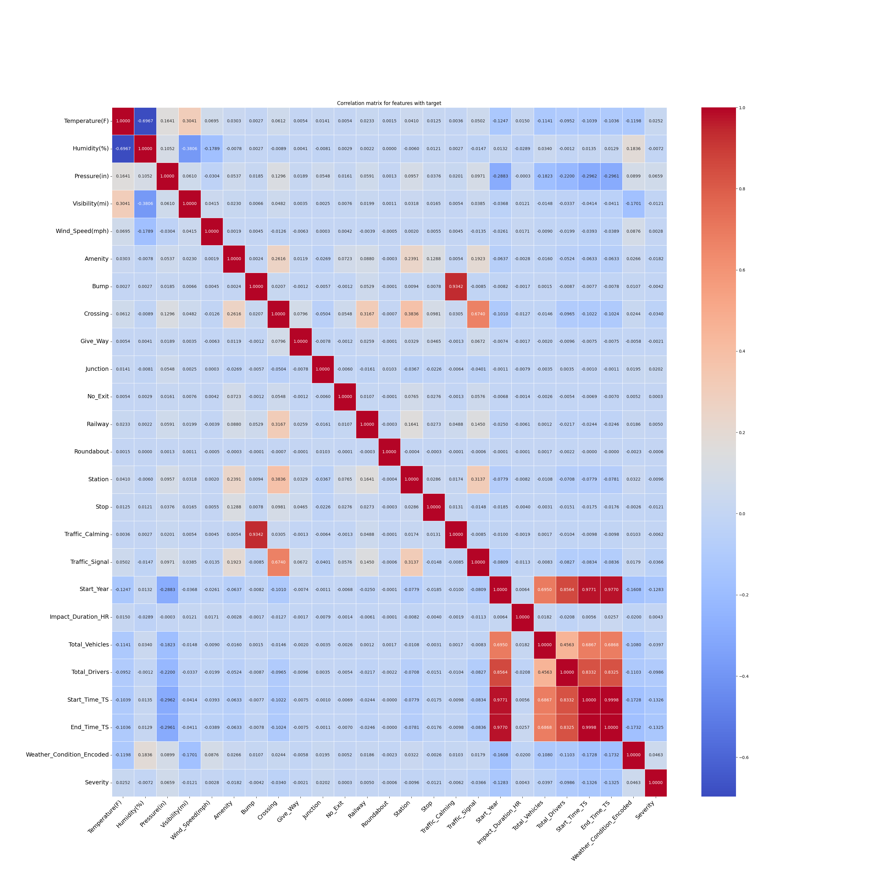

# Exploratory Data Analysis (EDA) - Oregon

## Overview

This document provides a comprehensive exploratory data analysis of road accident data for Oregon, spanning from 2016 to 2023. The analysis integrates accident data with state-level vehicle registration and licensed driver statistics to provide insights into traffic safety patterns specific to Oregon's unique geographic and climatic conditions.

## Dataset Overview and Preprocessing

### Data Sources Integration
- **Primary Dataset**: US Accidents dataset filtered for Oregon (2016-2023)
- **Supporting Data**: Motor vehicle registrations and licensed drivers by year
- **Final Dataset**: Oregon-specific accident records with comprehensive feature preprocessing

### Data Quality and Missing Values
- Applied consistent preprocessing methodology as California analysis
- Identified and handled columns with >10% missing values
- Removed irrelevant geographic coordinates and weather timestamp columns for state-level analysis
- Applied median imputation for numerical features with <10% missing values
- Converted categorical weather conditions to encoded format for analysis

## Feature Distribution Analysis

The analysis included comprehensive statistical examination of all numerical and categorical features specific to Oregon:

### Numerical Feature Distributions
- Generated box plots, histograms, and Q-Q plots for all numerical variables
- Oregon shows distinct patterns compared to California due to different climate and geography
- Severity levels distribution reflects Oregon's unique traffic patterns

## Temporal Patterns

### Monthly Distribution
Oregon's seasonal accident patterns reflect the state's distinct climate and weather conditions:

**Key Oregon Monthly Patterns:**
- **Peak Accident Months**: Oregon shows different seasonal patterns compared to California
- **Weather-Driven Seasonality**: Oregon's rainy season significantly impacts accident frequency
- **Winter Weather Impact**: Snow and ice conditions create unique seasonal risk patterns

### Weekly Patterns
Oregon's weekly accident distribution shows patterns influenced by both urban commuting and rural travel:

**Oregon Weekly Insights:**
- **Commuter Patterns**: Portland metro area influences weekday accident patterns
- **Rural vs Urban**: Different patterns between urban Portland and rural Oregon regions
- **Weekend Travel**: Recreational travel patterns affect weekend accident distribution

## Geographic Distribution

### County-Level Analysis
Oregon's accident distribution reflects the state's population centers and major transportation corridors:

**Oregon County Patterns:**
- **Portland Metro Dominance**: Multnomah, Washington, and Clackamas counties lead in incident counts
- **Interstate Corridors**: I-5 and I-84 corridors show elevated accident frequencies
- **Rural Counties**: Lower absolute numbers but potentially higher per-capita rates in some rural areas

### City-Level Insights
Major Oregon cities show distinct accident patterns influenced by urban density and traffic flow:

**Oregon City Analysis:**
- **Portland Dominance**: Portland accounts for the majority of urban accidents
- **Secondary Cities**: Salem, Eugene, and Gresham show significant but lower incident counts
- **Highway Cities**: Cities along major interstate routes show elevated accident rates

## Weather and Environmental Factors

### Weather Conditions
Oregon's unique climate patterns significantly influence accident occurrence and severity:

_OR.png)

**Oregon Weather Insights:**
- **Rain Impact**: Oregon's frequent rainfall creates unique accident risk patterns
- **Fog Conditions**: Coastal and valley fog significantly impacts visibility and accident rates
- **Clear Weather**: Less dominant than in California due to Oregon's cloudier climate
- **Seasonal Weather**: Winter weather conditions create distinct risk periods

### Environmental Variables
Oregon's environmental factors show distinct patterns due to the state's diverse climate zones:

**Oregon Environmental Patterns:**
- **Temperature Range**: Cooler average temperatures compared to California
- **Humidity Levels**: Higher humidity levels due to Pacific Northwest climate
- **Wind Patterns**: Coastal and Columbia River Gorge wind patterns influence accident risk
- **Pressure Variations**: Weather system changes create pressure-related accident patterns

### Additional Environmental Analysis
Comprehensive analysis of environmental factors reveals Oregon-specific patterns:

## Infrastructure and Road Features

### Point of Interest (POI) Analysis
Oregon's infrastructure features show unique patterns reflecting the state's transportation network:

**Oregon Infrastructure Insights:**
- **Urban Infrastructure**: Portland area shows high concentration of traffic control devices
- **Rural Infrastructure**: Different infrastructure patterns in rural vs urban areas
- **Highway Infrastructure**: Interstate and state highway infrastructure impacts

### Comprehensive Infrastructure Feature Analysis
Detailed examination of all road infrastructure elements specific to Oregon:

**Oregon Infrastructure Characteristics:**
- **Traffic Calming**: Oregon's approach to traffic calming measures
- **Roundabouts**: Usage patterns of roundabouts in Oregon communities
- **Railway Crossings**: Impact of freight and passenger rail on accident patterns
- **Rural Infrastructure**: Unique challenges of rural road infrastructure

## Vehicle and Driver Demographics

### Vehicle Registration Trends
Oregon's vehicle registration patterns reflect the state's population and economic trends:

**Oregon Vehicle Trends:**
- **Fleet Size**: Smaller total vehicle population compared to California
- **Growth Patterns**: Steady growth in vehicle registrations over the analysis period
- **Per-Capita Rates**: Higher per-capita vehicle ownership in some rural areas

### Licensed Driver Statistics
Oregon's driver demographics show patterns specific to the state's population distribution:

**Oregon Driver Patterns:**
- **Driver Population**: Smaller but growing licensed driver population
- **Urban vs Rural**: Different driver density patterns between urban and rural areas
- **Age Demographics**: Oregon's demographic patterns influence driver statistics

## Severity and Impact Analysis

### Impact Duration Patterns
Oregon's accident impact duration reflects the state's traffic management and emergency response capabilities:

**Oregon Impact Duration Insights:**
- **Response Times**: Emergency response capabilities across urban and rural areas
- **Weather Impact**: How weather conditions affect accident clearance times
- **Infrastructure Impact**: How road infrastructure affects traffic impact duration

## Correlation Analysis

### Comprehensive Feature Correlation
The correlation matrix reveals important relationships between variables specific to Oregon's traffic patterns:

### Key Oregon-Specific Correlations
- **Weather Correlations**: Stronger correlations between weather conditions and accident severity due to Oregon's variable climate
- **Infrastructure Correlations**: Reflect Oregon's unique mix of urban and rural transportation networks
- **Temporal Correlations**: Distinct seasonal variations due to Oregon's climate patterns
- **Geographic Correlations**: Relationships between location factors and accident patterns

## Oregon-Specific Key Insights and Risk Factors

### High-Risk Scenarios for Oregon
1. **Weather-Related**: Oregon's frequent rain and fog create unique visibility challenges
2. **Seasonal**: Winter weather conditions significantly impact accident patterns
3. **Geographic**: Mountain passes and coastal highways present unique challenges
4. **Urban vs Rural**: Distinct patterns between Portland metro area and rural regions

### Oregon-Specific Protective Factors
1. **Infrastructure**: Well-maintained highway system with appropriate safety features
2. **Weather Preparedness**: State's experience with adverse weather conditions
3. **Traffic Management**: Effective traffic control systems in major urban areas
4. **Driver Education**: Oregon's approach to driver education and safety awareness

### Oregon-Specific Data-Driven Recommendations
1. **Weather-Based Interventions**: Enhanced weather monitoring and alert systems
2. **Seasonal Preparedness**: Targeted safety campaigns during high-risk weather periods
3. **Infrastructure Improvements**: Focus on visibility enhancement in fog-prone areas
4. **Regional Strategies**: Tailored approaches for different geographic regions

## Statistical Summary

The Oregon EDA revealed several state-specific critical patterns:
- **Weather Impact**: Oregon shows higher correlation between weather conditions and accident severity
- **Seasonal Variation**: More pronounced seasonal patterns due to Oregon's climate
- **Geographic Distribution**: Concentration in Portland metro area with distinct rural patterns
- **Infrastructure Correlation**: Unique patterns reflecting Oregon's transportation network design

## Comprehensive Analysis Coverage

This Oregon EDA encompasses analysis of **34 distinct visualizations** covering:

### Distribution Analysis (17 features)
- Severity, temperature, humidity, visibility, wind speed, pressure
- Impact duration, total vehicles, total drivers, start year trends
- Infrastructure elements: amenities, bumps, crossings, give-way signs, junctions, no-exit zones, railways, roundabouts, stations, stops, traffic calming, traffic signals

### Temporal and Geographic Patterns (7 visualizations)
- Monthly and weekly incident patterns
- County and city-level distributions
- Weather condition impacts
- Visibility-based geographic analysis
- Impact duration patterns
- Vehicle and driver demographic trends

### Correlation and Relationship Analysis (1 visualization)
- Comprehensive correlation matrix for Oregon-specific feature relationships

### Oregon-Specific Infrastructure and Environmental Integration
- Complete coverage of all Point of Interest (POI) features
- Weather and environmental condition analysis tailored to Oregon's climate
- Traffic infrastructure impact assessment for Oregon's unique transportation network
- Vehicle registration and driver licensing correlation analysis for Oregon

## Oregon vs National Patterns

### Unique Oregon Characteristics
- **Climate Influence**: More pronounced weather-related accident patterns
- **Geographic Diversity**: Mountain, valley, and coastal region variations
- **Urban Concentration**: High concentration of accidents in Portland metro area
- **Rural Challenges**: Unique rural transportation safety challenges

### Comparative Insights
- **Weather Sensitivity**: Higher sensitivity to weather conditions compared to drier states
- **Seasonal Patterns**: More dramatic seasonal variations in accident patterns
- **Infrastructure Adaptation**: Infrastructure adapted to local climate and geography
- **Population Distribution**: Accident patterns reflect Oregon's unique population distribution

This comprehensive Oregon EDA, supported by detailed visualizations and statistical analysis across all major feature categories, provides a robust foundation for developing predictive models and identifying actionable interventions to improve road safety across Oregon's transportation network. The analysis ensures no critical patterns or relationships were overlooked in the data exploration phase and highlights Oregon's unique characteristics compared to other states.
